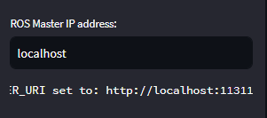

# ROSクライアントWebUI

ROSクライアントWebUIは、ROSシステムのパラメータを取得し、トピックを購読し、サービスを呼び出すためのシンプルなWebインターフェースです。


## 必要条件

- Python 3.7以上
- ROS Noeticまたは互換バージョン
- Streamlit

## インストール

### Streamlitのインストール

```
pip install streamlit
```

## 使い方

1. まず、ROSマスターを起動します。

```
roscore
```

2. 次に、このツールを実行します。

```
streamlit run app.py
```

3. ブラウザで表示されたWebUIを使用して、ROSパラメータを取得したり、トピックを購読したり、サービスを呼び出したりします。

## ROS_MASTER_URIの設定

このツールは、WebUIからROSマスターへの接続を設定することができます。WebUIのサイドバーには、ROSマスターが実行されているPCのIPアドレスを入力するテキストボックスが表示されます。このIPアドレスを使用して、`ROS_MASTER_URI`環境変数が自動的に設定されます。

### 手順

1. WebUIを開きます。
2. サイドバーの"ROS Master IP address"フィールドに、ROSマスターが実行されているPCのIPアドレスを入力します。
3. `ROS_MASTER_URI`が設定されると、その値がサイドバーに表示されます。

これで、ツールは指定されたROSマスターに接続します。トピック、サービス、およびパラメータのリストを表示し、サービスを呼び出すなどの操作を行うことができます。



注意: ツールを再起動すると、`ROS_MASTER_URI`の設定がクリアされるため、再度設定する必要があります。


## 機能

- **ROSパラメータ**: ドロップダウンリストからROSパラメータを選択して値を表示します。
- **ROSトピック**: ドロップダウンリストからトピックを選択し、トピックからのメッセージを受信します。受信ボタンを押すと、選択したトピックからメッセージを受信します。
- **ROSサービス**: ドロップダウンリストからサービスを選択し、引数を指定してサービスを呼び出します。

## ライセンス

MIT License
