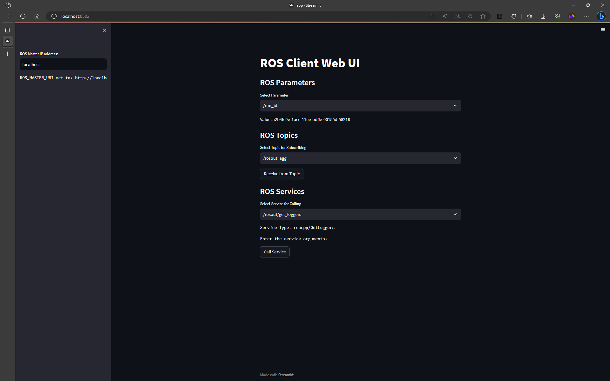

# ROSクライアントWebUI

ROSクライアントWebUIは、ROSシステムのパラメータを取得し、トピックを購読し、サービスを呼び出すためのシンプルなWebインターフェースです。



## 必要条件

- Python 3.7以上
- ROS Noeticまたは互換バージョン
- Streamlit

## インストール

### Streamlitのインストール

```
pip install streamlit
```

## 使い方

1. まず、ROSマスターを起動します。

```
roscore
```

2. 次に、このツールを実行します。

```
streamlit run app.py
```

3. ブラウザで表示されたWebUIを使用して、ROSパラメータを取得したり、トピックを購読したり、サービスを呼び出したりします。

## 機能

- **ROSパラメータ**: ドロップダウンリストからROSパラメータを選択して値を表示します。
- **ROSトピック**: ドロップダウンリストからトピックを選択し、トピックからのメッセージを受信します。受信ボタンを押すと、選択したトピックからメッセージを受信します。
- **ROSサービス**: ドロップダウンリストからサービスを選択し、引数を指定してサービスを呼び出します。

## ライセンス

MIT License
